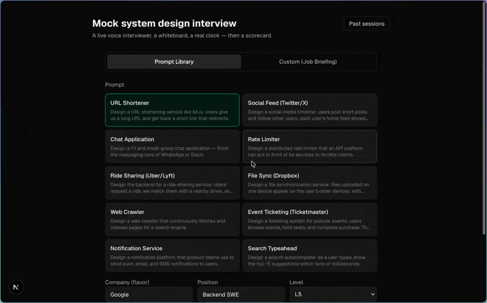

# Mock System Design Interviewer

A voice-driven mock system design interview app. You draw on an Excalidraw
whiteboard while a GPT-Live-1 interviewer runs the session — delivers the
prompt, answers clarifying questions from a hidden fact sheet, probes your
design, and wraps on time. Afterwards you get a timestamped scorecard graded
against a FAANG-style rubric, the call recording, and a replayable transcript +
board timeline.

## Demo



## How it works

- **Voice**: `gpt-live-1` over WebRTC. The browser sends an SDP offer to
  `POST /api/live/session`, which attaches the interviewer persona + fact sheet
  and forwards to `POST /v1/live/sessions` — the API key never leaves the server.
- **Interviewer brain**: the fact sheet lives in the live model's instructions
  (clarifying questions get instant answers). Deeper reasoning is delegated to a
  Responses model (`delegation.type: "responses"`) with a `view_whiteboard` tool
  and low reasoning effort for low-latency probes.
- **Whiteboard awareness**: on each drawing pause (~4s), a compact structural
  summary (labeled shapes + arrow bindings) is pushed silently via
  `session.thinking.append`. Capped PNG milestone snapshots are retained for
  grading; a capped JPEG is sent to the delegated backend only when its
  `view_whiteboard` tool requests a fresh look.
- **Timeline**: transcript fragments (`session.input/output_transcript.delta`)
  are grouped into turns and merged with board summaries, phase markers, and
  snapshot references on the session's ms timeline.
- **Recording**: sessions are created with `store: true`; the stereo WAV
  (candidate left / interviewer right) is downloaded after the interview and
  served on the review page.
- **Grading**: a vision-capable Responses model gets the rubric, the transcript,
  the board timeline, and milestone PNGs, and returns a structured scorecard
  including a mechanical trade-off audit (every architectural choice → was an
  alternative + reason stated?).

## Setup

```bash
npm install
# create .env with:
#   OPENAI_API_KEY=sk-...        (project needs GPT-Live access + session storage enabled)
#   LIVE_MODEL=gpt-live-1        (optional)
#   LIVE_BACKEND_MODEL=gpt-5.6-terra
#   GRADING_MODEL=gpt-5.6-terra
#   PROMPT_GEN_MODEL=gpt-5.6-terra
#   IMAGE_PUSH_MODE=queue-only   (queue-only | queue-and-run | off)
#   OPENAI_BASE_URL=https://api.openai.com/v1  (optional API/mock override)
npm run dev
```

Open http://localhost:3000 — pick a library prompt or generate one from a
company/role briefing, then join with mic + speaker.

## Testing

```bash
npm run check:pure      # deterministic logic checks
npm run test:e2e:mock   # no-cost browser E2E against a local OpenAI mock
npm run smoke:live      # real GPT-Live smoke test (paid/stateful)
npm run smoke:live:debug # instrumented GPT-Live protocol probe (paid/stateful)
```

The mocked E2E builds the app, starts a temporary production server and local OpenAI-compatible server, stubs the browser's WebRTC/microphone APIs with Playwright, and uses a temporary SQLite directory. It does not call OpenAI.

The live debug smoke uses the real API. It records data-channel message order and byte sizes, verifies `response.completed` and `session.closed` arrive before teardown, draws a visual-only code, asserts the delegated backend reads that code from the image, and polls recording/grading to completion.

## Notes

- Cost: ~$0.05/min for the voice layer (~$2.25 for 45 min) + backend/grading tokens.
- SQLite lives at `data/app.db`; snapshots and recordings under `data/`.
- Recordings require session storage enabled on the OpenAI project and expire in 30 days.
- 60-minute sessions are marked experimental — the Live duration cap is unverified
  (the old Realtime cap was 60 min); an `expired` close auto-ends and grades the session.
